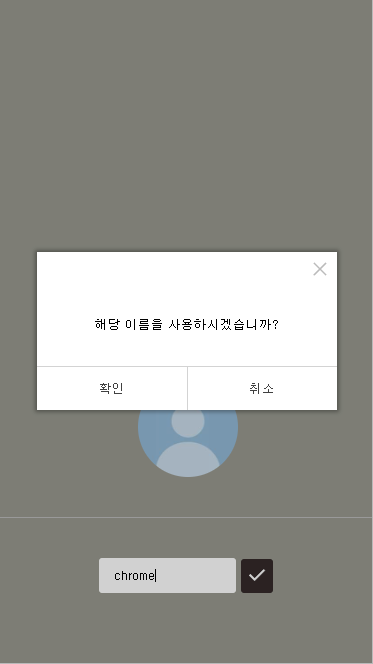
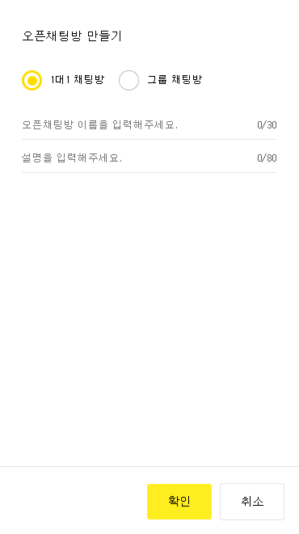
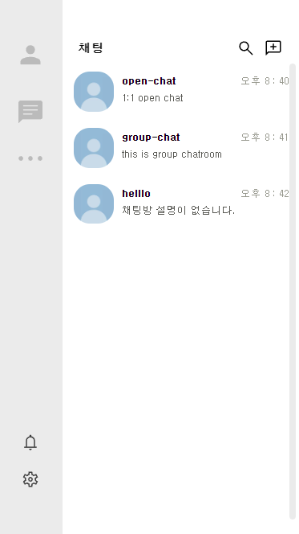
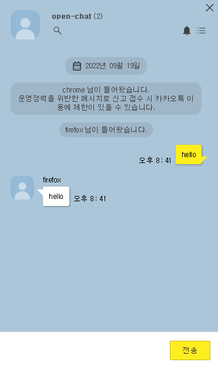

# open chat

카카오톡 디자인의 socket.io 채팅 (React, NodeJS)

- 1대1 채팅 : WebRTC (P2P)  
  https://developer.mozilla.org/ko/docs/Web/API/WebRTC_API

- 그룹 채팅 : socket.io  
  https://socket.io/docs/v3/

※ 채팅 외에 다른 기능은 없음

#

pc 버전의 경우 아래와 같이 보임 :

모바일 :

  
시작 화면

   
이름 설정

  
채팅방 생성

  
목록

  
채팅 화면

